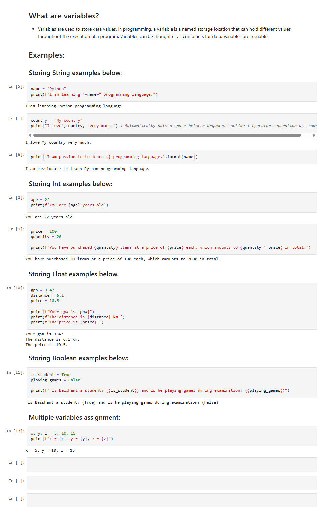

# Python Beginners Practice Set

- This project is about solving basic python problems.
- It aims to cover all the python fundamentals

  


## Installation

```bash
git clone https://github.com/Baishant01/Python-Beginners-PS.git
```
    
## Project Structure
```
Python-Beginners-PS repo/
├── 01_basics/
│   ├── variables.py
|   ├── datatypes.py
|   ├── input_output.py
│   └── operators.py       
├── 02_control_flow/
│   ├── if_else.py        
│   └── loops.py
├── images/                             
├── requirements.txt     
└── README.md          
```
## Appendices

### [Appendices-1: python basics ](https://github.com/Baishant01/Python-Beginners-PS/tree/main/01_basics/)
### [Appendices-2: python control flow ]()


## Demo




## Python.org Documentation

[Beginner's Guide](https://docs.python.org/3/tutorial/index.html)
